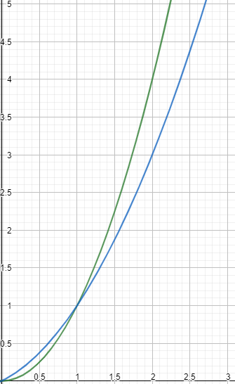
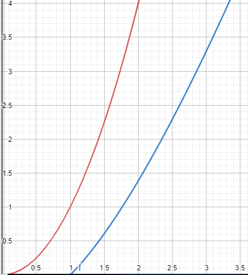

# comp110-worksheet-5
Base repository for COMP110 worksheet 5

a) It’s a procedure called “HASDUPLICATE” that takes in a list and then uses a nested for loops to check if any item is in the list more than once. If this is true, the procedure returns true. If not, then the procedure returns false.  

b) The worst-case complexity for the procedure would be n^2 as each value is being use twice as there are two for loops going on at once, so one for loop would have a worse case complexity of n but as there are two loops then the complexity is n * n or n^2. 

c) The procedure would still work but values that have already be check won’t be check again, in the first procedure the program checks every combination even if the combination has already been checked. Where as in the second procedure the same combinations are only checked once. The program will still work as every combination is checked but in a more efficient manner. 

d) Old procedure comparing I to j (Key: i=j. Where each number represent its place in the list). In the first procedure all the combinations of positions in the lists are compared, this has drawbacks as some combinations are compared multiple times.  

New procedure comparing I to j. In the second procure duplicates of pairs are taken out so every combination is only checked once.  

The graph shows the compleixty of the two programes, with the green cuvre being the first algorithm (y=x^2) and the blue line being the second algorithm (y=0.5x^2+0.5x).

 

e) The new procedure would be slightly more efficient then quadratic as instead of having every position checked against every position redundant check are now not made thus saving more time. A pattern for the first procedure would follow the curve y=x^2, while the new procedure would follow the curve y=0.5x^2+0.5x, better know at the triagnle number sequence. So the big O notation for the new algorithm would still be O(x^2).       

f) Python’s built in sort function uses a timsort algorithm. A timsort algorithm is a combination of the merge and insertion sort algorithms (https://stackoverflow.com/questions/10948920/what-algorithm-does-pythons-sorted-use). A timsort algorithm has a time complexity of O(nlogn) for the worst case and for the best case time complexity it has a O(n) (https://dev.to/s_awdesh/timsort-fastest-sorting-algorithm-for-real-world-problems--2jhd).     

g) The time complexity of the procedure would be O(nlogn * n) as the timsort algorithm is run (the timsort algorithm has a time complexity of nlogn) then the procedure loops through the if statement comparing items in the list just the first procedure (this has a time complexity of n). So, when both are combined you get nlogn * n.   

h) If the size of the input list is large, then the second procedure would run faster as the worst time complexity for the timsort algorithm is nlogn, whereas the first algorithm has a worst time complexity of n^2, and the n^2 graph is worse than the nlogn graph. Red is y=x^2, Blue is y= n * log(n)

i) A “slower” algorithm may be chose over a “faster” algorithm because the programmer may not know of a faster algorithm, the slower algorithm may have other upside such as saving memory, the slower algorithm may use more programming techniques.

